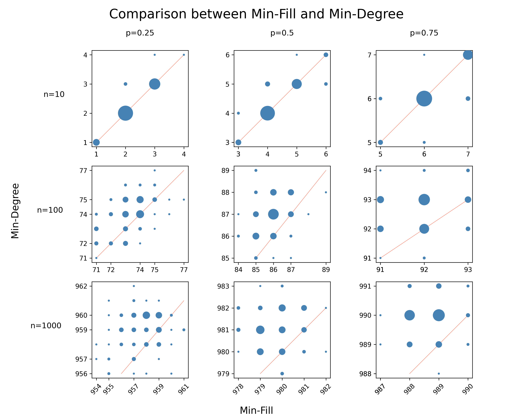
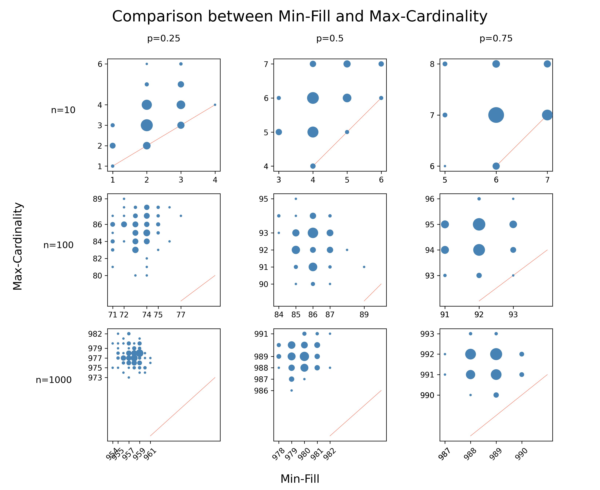
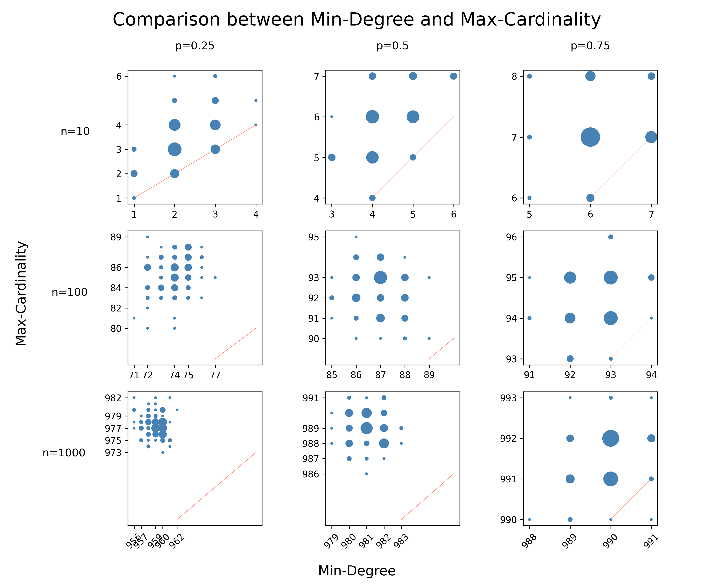

# Notes and Requirements
- This implementation requires `c++20` (specifically the `contains` method for unordered sets) for performance reasons
- By default, the `Makefile` uses `g++11` as a compiler, this can be adapted to any compiler (that supports `g++11`)
- Based on the input format and the implementation, edge or vertex labels and directed edges are **not supported**
- In order to improve performance, the recursive decomposition function does not take a separate elimination ordering as input, but rather directly eliminates from the graph. The significantly reduces the runtime since it halves the number of vertex eliminations (which constitute the bottleneck)


# Build and Execution
- *The default OS for development and thus building/execution is Linux (Mint)*

**Build:** simply call `make` in the base directory (so within `/sda-heuristics`)

### Execution
```bash
    ./build/heuristics <graph source file> <heuristics method tag>
```
Possible heuristics method tags *(ordered from slowest to fastest)*: `fill`, `degree` and `mcs`

### Example
```shell
    ./build/heuristics graph.txt fill
```


# Results
## `dataGeneration.py` 
This script is used to generate the results for all configurations. It randomly generates the graphs, calls each heuristics method on the graph and collects the width results, which are then stored in `results/widthResults.npz`. The runtime of this script is about **8 hours**.

## `plotting.py`
This script takes the results from `dataGeneration.py` and generates three plots (for each pair of methods), with each plot containing three subplots with all possible *n,p*-configurations.

## Plots
- The points indicate the pairwise width for a given random network where each coordinate corresponds to a method
- Since points often overlap, they are combined and the size corresponds to the number of points with the given coordinate
- the red line indicates the diagonal (i,i) where both methods produce the same width








## Short Interpretation
- The width generated correlates with the runtime required by each method, with `fill` being the slowest (and best) and `mcs` being the fastest (but worst)
- Comparison between `fill` and `degree` is close, but especially for large graphs `fill` provides better orderings
- `mcs` is significantly worse than both `fill` and `degree` 
- Based on my perception, `degree` provides the best tradeoff between width and runtime